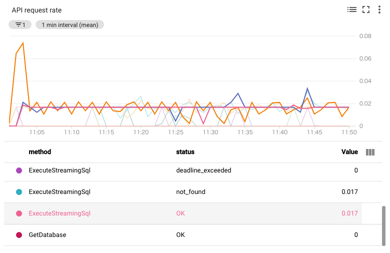
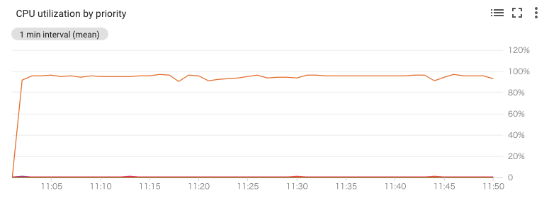
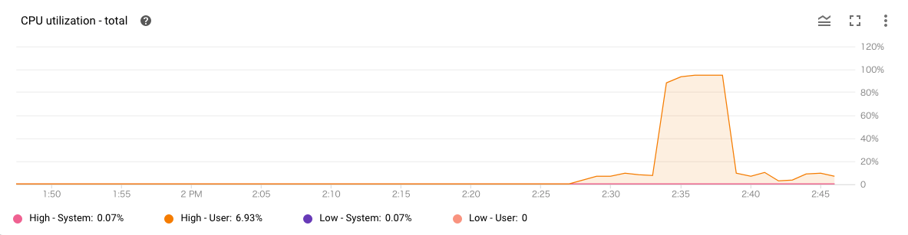

google cloud go の Client LibraryでQuery投げてる状態で Session Delete するとどうなるのかな？と思って、試してみた。

中でSession取り直して頑張るようで、延々ともぐらたたきのようにSessionをDeleteし続けることとなった。

```
DeleteSession:AN4G3x-1HeKsPxc7vijyzNCflrVGBbW8Qi9Na_Fe9rxDPMsAsENY5tQWb7K_, text=SELECT "Single", OrderId, OrderDetailId, OD.Price, Item.ItemID, Item.Name As ItemName, Item.Price As ItemPrice, OD.CommitedAt FROM OrderDetail1M OD JOIN Item1K Item ON OD.ItemId = Item.ItemId ORDER BY ItemId LIMIT 100000
DeleteSession:AN4G3x907fHAmT17JMGV9iyoRt8UC4xLotG2FmrJ9l5X0QpG0OT1GfGZ-SM-, text=SELECT "RWTx", OrderId, OrderDetailId, OD.Price, Item.ItemID, Item.Name As ItemName, Item.Price As ItemPrice, OD.CommitedAt FROM OrderDetail1M OD JOIN Item1K Item ON OD.ItemId = Item.ItemId ORDER BY ItemId LIMIT 100000
DeleteSession:AN4G3x-R7bs1ZsJUP6UK_29MiVOFzCZszkHYZ6ki0cN96Dte0CdYs0a0S5ZV, text=SELECT "RWTx", OrderId, OrderDetailId, OD.Price, Item.ItemID, Item.Name As ItemName, Item.Price As ItemPrice, OD.CommitedAt FROM OrderDetail1M OD JOIN Item1K Item ON OD.ItemId = Item.ItemId ORDER BY ItemId LIMIT 100000
DeleteSession:AN4G3x9nUsK8FGc7bj_HCuShcV02W04Fzz_uGi7Wh9JROiFIagW_0uCM_UjD, text=SELECT "Single", OrderId, OrderDetailId, OD.Price, Item.ItemID, Item.Name As ItemName, Item.Price As ItemPrice, OD.CommitedAt FROM OrderDetail1M OD JOIN Item1K Item ON OD.ItemId = Item.ItemId ORDER BY ItemId LIMIT 100000
DeleteSession:AN4G3x_k04um2VTZM80OcZ4gsy3-eLTGrnybEVOPdTYkal1mh-iEenGGP2j4, text=SELECT "Single", OrderId, OrderDetailId, OD.Price, Item.ItemID, Item.Name As ItemName, Item.Price As ItemPrice, OD.CommitedAt FROM OrderDetail1M OD JOIN Item1K Item ON OD.ItemId = Item.ItemId ORDER BY ItemId LIMIT 100000
DeleteSession:AN4G3x-P2YPAM-QwqHYTdFEFY9kUTyRoU_hQff4d15pu7sOq5OKTffovRuSq, text=SELECT "RWTx", OrderId, OrderDetailId, OD.Price, Item.ItemID, Item.Name As ItemName, Item.Price As ItemPrice, OD.CommitedAt FROM OrderDetail1M OD JOIN Item1K Item ON OD.ItemId = Item.ItemId ORDER BY ItemId LIMIT 100000
DeleteSession:AN4G3x___uTH0PbkAHreKp7o4Sn6HdF3ukWJhalV3gGl7OQx6GJ-OoQ_Njuc, text=SELECT "RWTx", OrderId, OrderDetailId, OD.Price, Item.ItemID, Item.Name As ItemName, Item.Price As ItemPrice, OD.CommitedAt FROM OrderDetail1M OD JOIN Item1K Item ON OD.ItemId = Item.ItemId ORDER BY ItemId LIMIT 100000
DeleteSession:AN4G3x9Qv56MQ7SgnMVA4UGThHLPh4t8p9KOYV3TlUyxdwfi0idRqKhTrg2H, text=SELECT "Single", OrderId, OrderDetailId, OD.Price, Item.ItemID, Item.Name As ItemName, Item.Price As ItemPrice, OD.CommitedAt FROM OrderDetail1M OD JOIN Item1K Item ON OD.ItemId = Item.ItemId ORDER BY ItemId LIMIT 100000
DeleteSession:AN4G3x9-16_05qwv65oBevWr9bAVFYtTwWV_dD7MiSBT4apJw1_qSUAJgM_s, text=SELECT "Single", OrderId, OrderDetailId, OD.Price, Item.ItemID, Item.Name As ItemName, Item.Price As ItemPrice, OD.CommitedAt FROM OrderDetail1M OD JOIN Item1K Item ON OD.ItemId = Item.ItemId ORDER BY ItemId LIMIT 100000
DeleteSession:AN4G3x9pbasBybURA9_0zMzy-S05IaOsByerVst6xnpYF7_hvqK92VchF6R0, text=SELECT "RWTx", OrderId, OrderDetailId, OD.Price, Item.ItemID, Item.Name As ItemName, Item.Price As ItemPrice, OD.CommitedAt FROM OrderDetail1M OD JOIN Item1K Item ON OD.ItemId = Item.ItemId ORDER BY ItemId LIMIT 100000
DeleteSession:AN4G3x-huGtvdlKxj8RRyTgIkZqx38hkBi0JJa0l-hxqHIuS8Vriif9-weO0, text=SELECT "RWTx", OrderId, OrderDetailId, OD.Price, Item.ItemID, Item.Name As ItemName, Item.Price As ItemPrice, OD.CommitedAt FROM OrderDetail1M OD JOIN Item1K Item ON OD.ItemId = Item.ItemId ORDER BY ItemId LIMIT 100000
DeleteSession:AN4G3x8Z8Mw_ex-KUvJiOa496touOcg5IhfPNR2o5pbKoXMG0gmDKu46YItg, text=SELECT "Single", OrderId, OrderDetailId, OD.Price, Item.ItemID, Item.Name As ItemName, Item.Price As ItemPrice, OD.CommitedAt FROM OrderDetail1M OD JOIN Item1K Item ON OD.ItemId = Item.ItemId ORDER BY ItemId LIMIT 100000
DeleteSession:AN4G3x-an2pRtKNi94utqWLjntJ19DkYYNesk0gzpDzljLvbEku41huWgCFB, text=SELECT "Single", OrderId, OrderDetailId, OD.Price, Item.ItemID, Item.Name As ItemName, Item.Price As ItemPrice, OD.CommitedAt FROM OrderDetail1M OD JOIN Item1K Item ON OD.ItemId = Item.ItemId ORDER BY ItemId LIMIT 100000
DeleteSession:AN4G3x_-Wu4VUNfIYdwbAKHXVNt4hG2-WiLB6pW8ntTm1gUkO1U0a_nkDmYS, text=SELECT "RWTx", OrderId, OrderDetailId, OD.Price, Item.ItemID, Item.Name As ItemName, Item.Price As ItemPrice, OD.CommitedAt FROM OrderDetail1M OD JOIN Item1K Item ON OD.ItemId = Item.ItemId ORDER BY ItemId LIMIT 100000
DeleteSession:AN4G3x_WUsz71aUx7dXx3qK4XQB32hBc2yO2Kgklxhh9VYfMl9OpYr-SOlyn, text=SELECT "Single", OrderId, OrderDetailId, OD.Price, Item.ItemID, Item.Name As ItemName, Item.Price As ItemPrice, OD.CommitedAt FROM OrderDetail1M OD JOIN Item1K Item ON OD.ItemId = Item.ItemId ORDER BY ItemId LIMIT 100000
DeleteSession:AN4G3x82AlqB4Pzi1AE6PLqnI-tVge-sXqzEFSicohebyXZdZOzNlzIjAgg4, text=SELECT "RWTx", OrderId, OrderDetailId, OD.Price, Item.ItemID, Item.Name As ItemName, Item.Price As ItemPrice, OD.CommitedAt FROM OrderDetail1M OD JOIN Item1K Item ON OD.ItemId = Item.ItemId ORDER BY ItemId LIMIT 100000
DeleteSession:AN4G3x_65Tbrw0_WMDKCGogpFP7aKaHZxTjwzYd-Jlumc_ZVrxFsXPNT5TO3, text=SELECT "RWTx", OrderId, OrderDetailId, OD.Price, Item.ItemID, Item.Name As ItemName, Item.Price As ItemPrice, OD.CommitedAt FROM OrderDetail1M OD JOIN Item1K Item ON OD.ItemId = Item.ItemId ORDER BY ItemId LIMIT 100000
DeleteSession:AN4G3x-5uuIXELa-YgfMwz9-EGuap9fFZ0aSEOInOHFjmCQ4qmLdl6aSvHuP, text=SELECT "Single", OrderId, OrderDetailId, OD.Price, Item.ItemID, Item.Name As ItemName, Item.Price As ItemPrice, OD.CommitedAt FROM OrderDetail1M OD JOIN Item1K Item ON OD.ItemId = Item.ItemId ORDER BY ItemId LIMIT 100000
DeleteSession:AN4G3x81Ib-7yTHYjuIpqJvBaSloCE5cQuOK132KSH3aulnM0X-RIiI7WDUy, text=SELECT "Single", OrderId, OrderDetailId, OD.Price, Item.ItemID, Item.Name As ItemName, Item.Price As ItemPrice, OD.CommitedAt FROM OrderDetail1M OD JOIN Item1K Item ON OD.ItemId = Item.ItemId ORDER BY ItemId LIMIT 100000
DeleteSession:AN4G3x9zDf7m15xwctFaRixlEZBEPPieyOQ8TXpFH8YRPLpNxSdAsig--uqQ, text=SELECT "RWTx", OrderId, OrderDetailId, OD.Price, Item.ItemID, Item.Name As ItemName, Item.Price As ItemPrice, OD.CommitedAt FROM OrderDetail1M OD JOIN Item1K Item ON OD.ItemId = Item.ItemId ORDER BY ItemId LIMIT 100000
DeleteSession:AN4G3x_0ptkfFSGcQCM1ILKAGXvIdvdBw4zI8zv5tkSpP9y6KdcXWzGowmr-, text=SELECT "Single", OrderId, OrderDetailId, OD.Price, Item.ItemID, Item.Name As ItemName, Item.Price As ItemPrice, OD.CommitedAt FROM OrderDetail1M OD JOIN Item1K Item ON OD.ItemId = Item.ItemId ORDER BY ItemId LIMIT 100000
DeleteSession:AN4G3x8a8UTfsEjG-hP9nFluQLtX4hWKpXRUC7OhIYSxvqexPA6YzIr3Z5gd, text=SELECT "RWTx", OrderId, OrderDetailId, OD.Price, Item.ItemID, Item.Name As ItemName, Item.Price As ItemPrice, OD.CommitedAt FROM OrderDetail1M OD JOIN Item1K Item ON OD.ItemId = Item.ItemId ORDER BY ItemId LIMIT 100000
```

### Session Create と Session Delete の仁義なき戦い



### CPUは高止まりのまま



## contextをcancelするとどうなる？

contextをcancelしてしまえば、QueryはRetryとかされずに止まるので、contextをcancelしてしまうのが一番手っ取り早い

